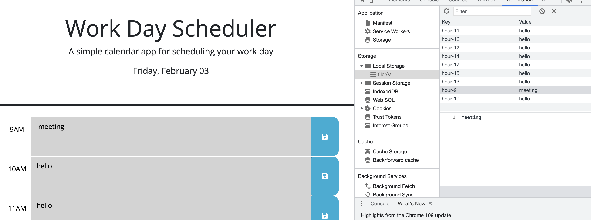
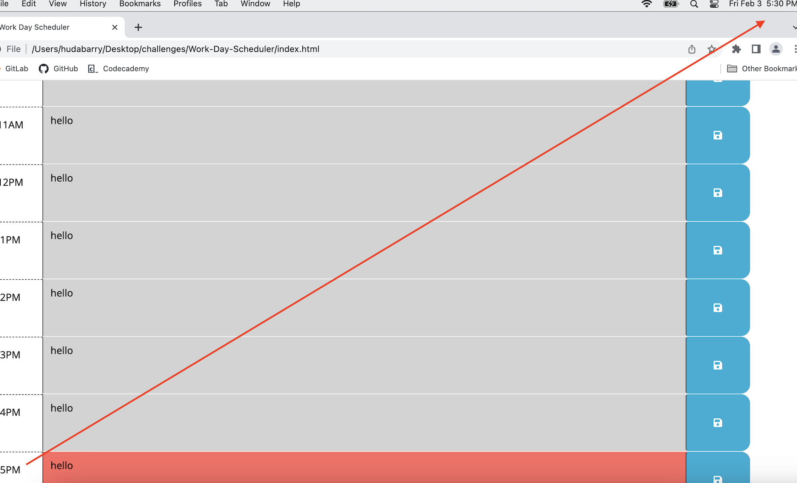

# Work-Day-Scheduler

## Description

- This is the fifth challenge.
- The purpose of this repository is for an employee to to add important events to a daily planner

## Usage

[Click here](https://hbarry89.github.io/Work-Day-Scheduler/) to navigate to the live link of this repository.

- Day and date is displayed at the top of the calendar that corresponds with the current day and date:

------------------------------------------------------------------------------------------------------

- Input is stored into the local storage and stays on page after refreshing:

------------------------------------------------------------------------------------------------------

- Color coding is showing based on your current time. Here time in red reflecting the current time (passed time is grayed out):

## Credit

### Resources
- Bootcamp Materials and Zoom recordings
- Worked with tutor and study group.
- [day.js](https://day.js.org/docs/en/display/format) library and documentation.

### Applications Used
- VS Code

## Thank you for visiting!

